####面试系列, JDK, JRE, JVM区别

1. JDK: java Development Kit

2. Java Runtime Environment

3. Java Virtual Machine

####Java 8基本数据类型

1. 整数类型

    byte, short, int, long

2. 小数类型

    flout, double

3. 字符类型

    char

4. 布尔类型

    boolean
    
####== 和 eques() 区别

1. 都有比较的含义

2. == 是算符, eques() 是Object 对象里面的方法

3. == 分为总情况:
   
   3.1 比较基本数据类型: 比较的是值
   3.2 比较引用数据类型: 比较的地址

4. 如果不去重写eques() 方法, 默认比较的是地址

####final 的作用

1. 不可变特性

2. 维度: 修饰类, 修饰变量, 修饰方法

3. 结果: 类不能被继承(String), 变量不可变(基本数据类型: 值不可变, 引用数据类型: 应用地址不可变), 方法不可被重写

##### String, StringBuilder, StringBuffer

1. 维度: 可变性, 线程安全性

2. String 由于使用final 修饰, 是不可变的, StringBuilder和StringBuffer都是可变对象, 最常用的方法就是append()方法, 用来做字符串的拼接

3. StringBuilder 线程不安全, StringBuffer 线程安全的对象

####抽象类和接口

1. Abstract, Interface

2. 1.8之后, 默认接口可以有默认的实现, 声明上加上default, static

####递归算法 N!
1. 规律: N! = N * (N-1)! 

2. 出口: 1! = 1, 0! = 1

```java
public static int getResult(int n) {

    if (n < 0) {
        throw new ValidateException("非法参数");
    }
    
    if (n == 0 || n==1) {
        return 1;
    }
    
    return getResult(n-1) * n;
    
}
```

####斐波那契额数列

1. 规律: 前两个数之后, 等于后面的数

2. 边界: 第一项和第二项都是1

```java
public static int getFeiBo(int n) {

    if (n < 0) {
        new throw VilidateException("参数不合法");
    }
    
    if (n == 1 || n == 2) {
        retrun 1;
    }
    
    return getFeiBo(n - 1) + getFeiBo(n - 2);
    
}
```

####方法的重载和重写
1. 重写: 父子类继承, 子类重写父类的方法.

2. 重载: 同一个类中

####冒泡排序

```java
public void bubbleSort(int[] array) {

    if (array.lenth <= 1) {
        return;
    }
    
    for (itn i = 0; i < array.length; i++) {
        boolean flag = false;
        
        for (int j = 0; j < array.length - i -1; j++) {
            if (array[j] > array[j+1]) {
                int temp = array[j];
                array[j] = array[j+1];
                array[j+1] = temp
                flag = true;
            }
        }
        
        if (!flag) {
            break;
        }
        
    }
    
}
```

####ArrayList 集合方面
1. 初始值是10 

2. 扩容是1.5倍扩容

3. 都可以看源码

####类加载器
1. 双亲委派机制
      
    1.1 好处: 避免相同的类重新加载, 沙箱机制保护源码的安全性.
    1.2 不足: Web容器(Tomcat)需要做一些改变.

2. BootStrapClassLoader、ExtClassLoader、AppClassLoader

#####ThreadLocal
结构: Thread 对应一个 ThreadLocalMap , Map(ThreadLocal, value). 对象实例和ThreadLocal由 Thread 维护
实现共享和隔离

####List, Set, Map
List: 
- ArrayList
- LinkedList

Set: 
- HashSet

Map: 
- HashMap: 
    1. 初始容量: 16
    2. 负载因子: 0.17
    3. HashMap 底层是采用链表解决哈希冲突:  
        3.1 数据结构: 1.7, 数组+链表, 1.8, 引入红黑树
        3.2 深度大于8 && 数组容量大于 64, 树化

####HashSet 添加对象时 PRESENT 对象的作用
1. 主要是 remove 和 add 方法, 如果使用 null 达不到准确判断的效果.

2. 如果是 null, 第一个add() 一个元素是 true , 第二次add() 同样的元素, 返回的还是true.

####HashTable, HashMap, ConcurrentHashMap 横向比较
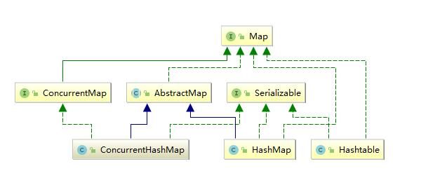

1. 线程的安全性角度.

HashTable: 线程安全.
HashMap: 线程不安全.
ConcurrentHashMap: 多用于并发场景. 

2. 底层原理: 1.8之后底层数据结构采用: 数组+链表+红黑树; 如何保证先发线程安全: cas + sychronized + voletail

####创建线程的方式
1. Thread

2. Runnable

3. Callable

4. 线程池 Excutor, ThreadPoolExcutor

####ThreadPoolExcutor 参数
1. 阻塞队列blockingQueue
2. core
3. max
4. Unit
5. 持续时间 activityTime
6. 抛弃策略 handler
7. 线程工程 threadFactory

####sleep(), wait()
1. 位置: sleep(), Thread; wait(), Object

2. 唤醒: notify(), notifyAll(), 同步代码块

####一个线程生命周期


####线程池分类
1. SingleThreadExecutor: 单线程池化的线程池

2. FixedThreadPool: 定长线程池

3. CachedThreadPool: 缓存

4. ScheduledThreadPool: 周期性执行

默认值很大, 容易造成 OOM

#### cookie 和session
1. 客服端, 服务端

2. 存储数据: string, object

3. 容量不同: 4k, 服务器配置

####三大范式
1. 列不可分

2. 主键

3. 依赖传递

####事务特点
ACID
1. Atomicity, 原子性, 基础

2. Consistency, 一致性, 约束条件

3. Isolation, 隔离性, 手段

4. Durability, 持久性, 目的

####隔离级别

1. 读未提交(read-uncommited)

2. 读已提交(read-commited)

3. 可重复读(repeatable-read)

4. 串行化(serializable)

####synchronized, volatile

1. 作用位置: 方法, 代码块; 变量 

2. 原理: 字节码指令剖析, monitor monitorexit; 工作内存, 强刷到主内存, 保证变量的可见性

3. 效果: 保证原子性, 可见性, 会阻塞; 只能保证可见性

####synchronize, lock 
1. 位置

2. 关键字, 对象

####深拷贝和浅拷贝
1. 主要区别在于对 引用数据类型变量的 拷贝

####XSS攻击
1. 脚本攻击

2. 过滤

#### 三次握手, 四次挥手

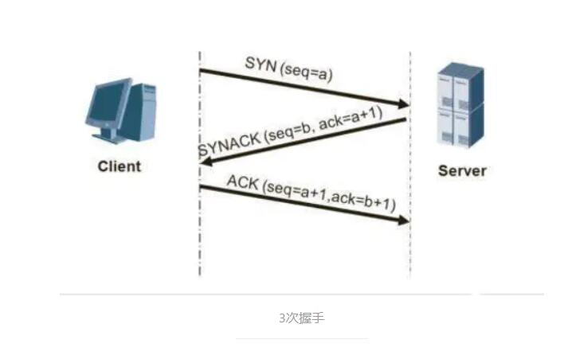

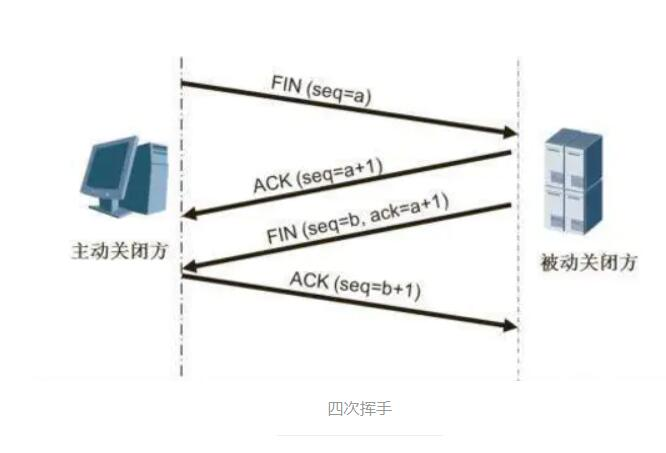


#### TCP, UDP

1. 需要先建立连接, 都是传输层的协议.

#### TCP/IP 网络分层

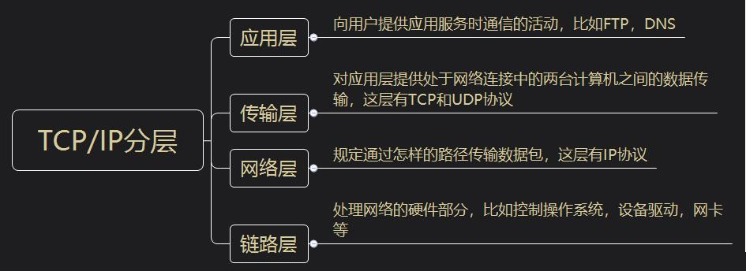


#### 死锁

1. 两个线程互相持有对方需要的锁, 从而发生阻塞, 形成死锁. 

#### Spring AOP 原理

1. 动态代理

#### Spring Bean作用域
1. scope: singleton, propotype, reqeust, session, global-session

#### SpringMVC执行流程

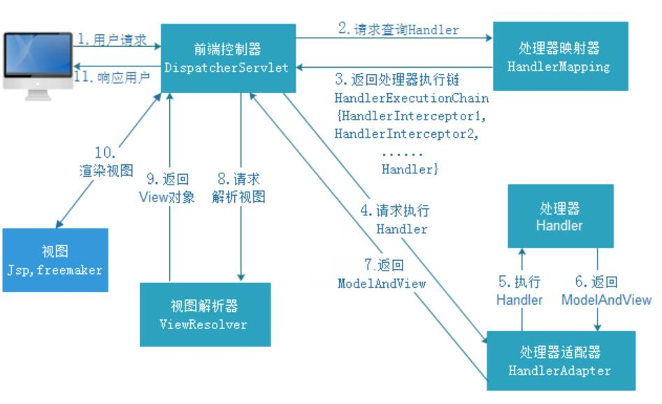

#### SpringMVC 常用注解

1. @RequestMapping
2. @PostMapping
3. @GetMapping
4. @Controller
5. @RestController
6. @RequestParam

#### Spring 事务的传播特性(Propgation)

1. 保证事物的一致性, 默认, Propgation_required

#### synchronized 原理

1. 1.6 是一个分水岭

2. 并发包作者 Doug Lea, 对 synchronize 做了优化

3. 1.6之后: 偏向锁   CAS的自旋锁(轻量锁)    重量锁

4. 1.6之前  monitorentry   monitorexit

#### JVM 内存模型

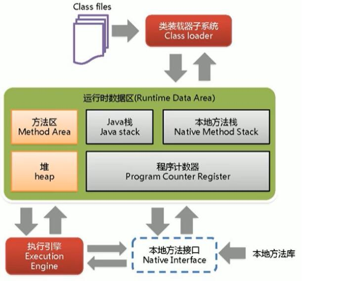

1. 类加载子系统: Class loader

2. 运行时数据区: Runtime Date Area

3. 执行引擎: Execution Engine

4. 本地方法接口: Native Interface

#### 运行时数据区

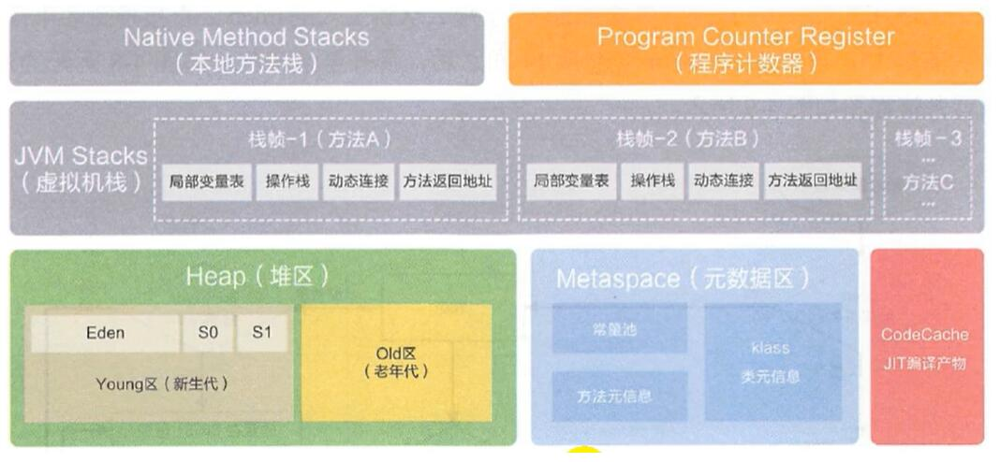

1. 共享: 堆, 堆外内存

2. 线程私有: 栈, 本地方法栈, 程序计数器

#### SpringBoot 运行原理

1. @SpringBootApplication

2. @EnableAutoConfigation

3. @Import

4. spring.factory

#### 创建线程的方式

1. 继承: Thread

2. 实现: Runnable, Callable

3. 线程池: 工具类, Executors

#### 线程池的分类

1. Executors.newFixedThreadPool : core == max

2. Executors.newSingleThreadPool : core == max == 1

3. Executor.newCachedThreadPool : 60s

4. Executor.newScheduledThreadPool : 

5. Executor.newWorkStealingPool : 

#### 线程的生命周期状态

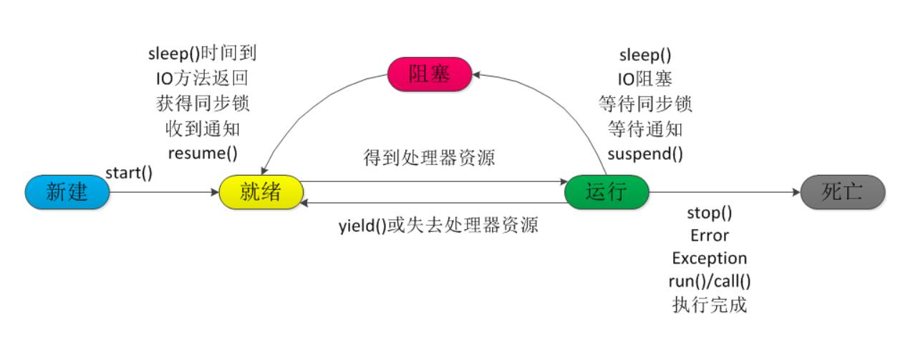

1. new

2. runnable

3. running

4. blockiing

5. dead

#### 守护进程

1. 优先级: 低

2. 设置: setDaemon(true)

3. 例子: gc线程

#### 重量锁/轻量锁

1. 用户态/核心态: 存在切换, 就是重量锁(慢)

#### CPU结构

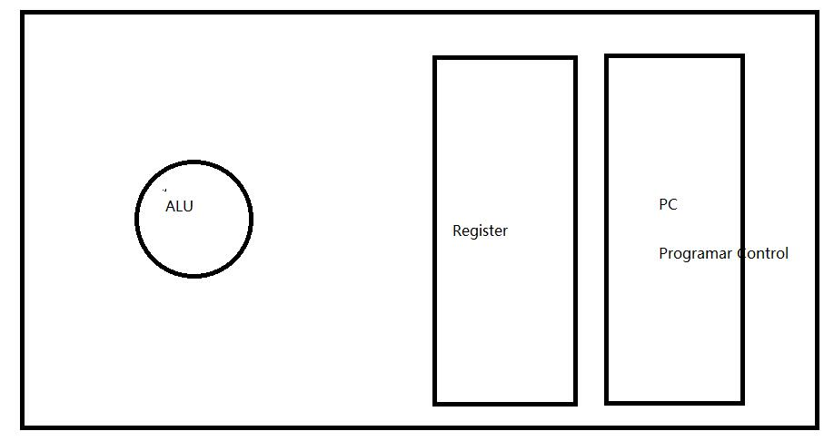

#### 线程池拒接策略

1. 接口: RejectedExecutionHandler

- 直接Abort(终止, 流产)并抛出异常: AbortPolicy

- 直接Discart(抛弃)不错任何处理: DiscardPolicy, 这个实现非常有趣, 就是什么都不做

- 抛弃最先进入队列的任务: DiscardOldestPolicy

- 插队: CallerRunsPolicy

#### 线程池工作原理

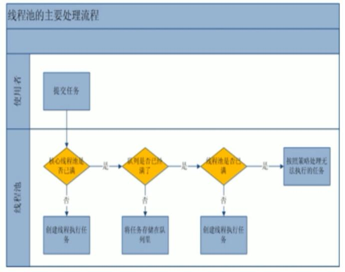

1. 核心线程数为主

2. 阻塞队列

3. 非核心线程的加入

4. 抛弃策略

#### CountDownLatch, CyclicBarrier, Semaphore

1. 线程的执行顺序, 某个线程最后执行.(班长最后关门的例子)

2. 达到某个数字, 执行某个线程. (人齐了, 开会的例子)

3. 多个线程, 抢占多个资源的例子. (6台车, 抢3个车位的例子)

#### 线程变量存储

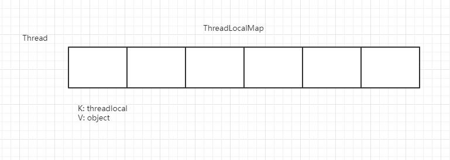

#### Java中线程的调度

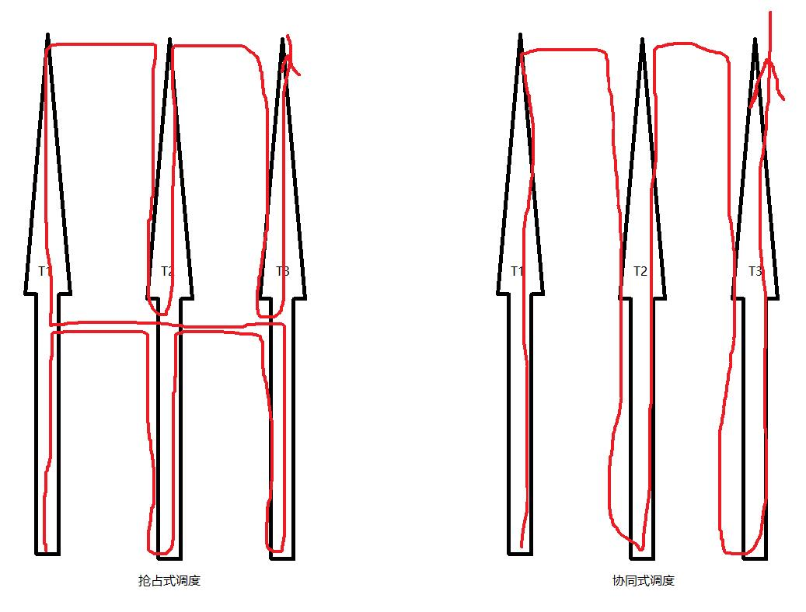

1. 抢占式

2. 协同式

#### B 树 和 B+ 树的区别

1. 最大的区别就是, 将数据都存储在叶子节点上, 形成链表, 聚簇索引

2. 然而, B 数的非叶子节点上, 还存在数据(这个是占用空间的)

3. 如果每一个Page 16K的空间, 放一些 data, 势必是太浪费了. 

4. B+ 数, 非叶子节点, 只存存储主键值, 并不会存储具体的 data


 


