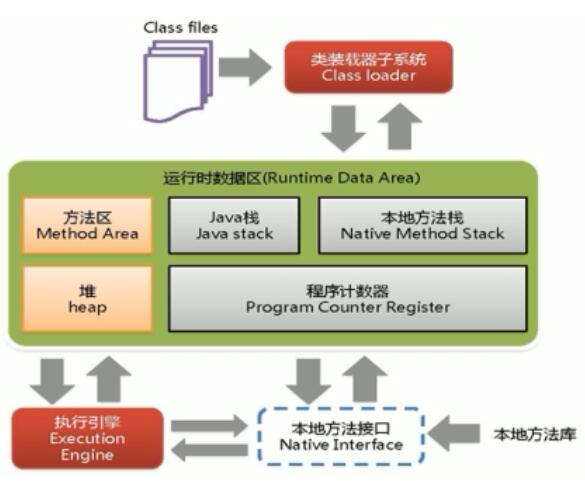
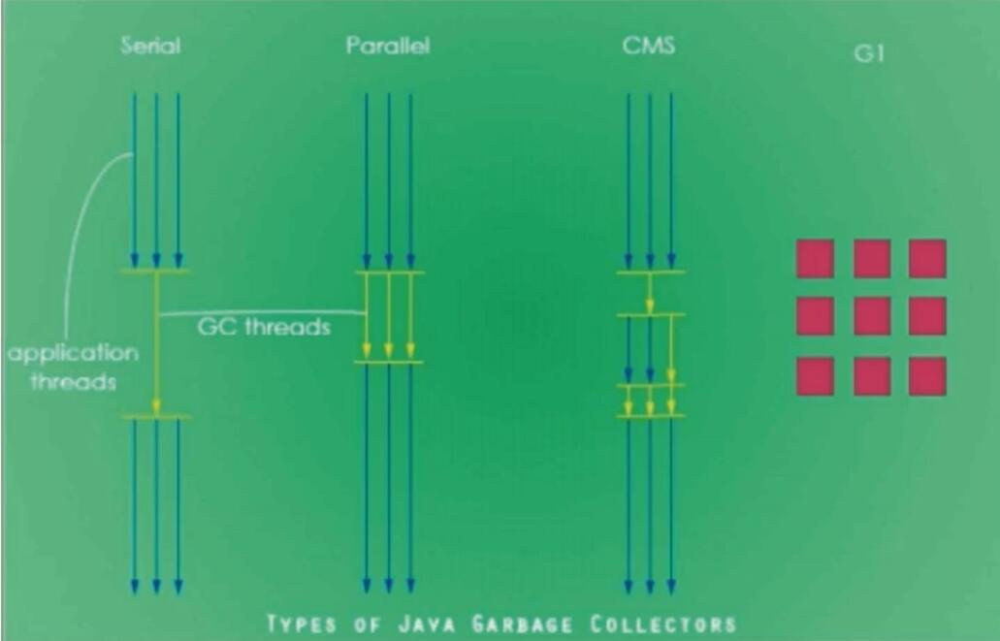

# JVM 内存模型



# 常见GC算法

```
1. 引用计数
2. 复制算法 (Minor GC)
2.1 首先, 新建的对象放到Eden区, Eden对象存满之后, 进行一个 Minor GC, 将存活的对象转移的From区, 当 Eden区再次放满对象时, Eden区 和 From
    区会进行第二次 Minor GC, 存活的对象会复制到 TO 区, 同时年龄+1, 达到标准后, 放到老年代 (MaxTenuringThreshold)
3. 标记清除
4. 标记压缩(Mark)
```

# JVM 实现的垃圾回收器



```
1. 串行垃圾回收器: Serial
2. 并行垃圾回收器: Parallel
3. CMS : ConMarkSweep
4. G1
5. ZGC
```


