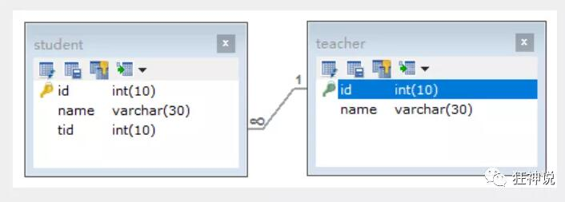

## 狂神说MyBatis05：一对多和多对一处理

> 狂神说MyBatis系列连载课程，通俗易懂，基于MyBatis3.5.2版本，欢迎各位狂粉转发关注学习，视频同步文档。未经作者授权，禁止转载

多对一处理

## 多对一的处理

多对一的理解：

- 多个学生对应一个老师
- 如果对于学生这边，就是一个多对一的现象，即从学生这边关联一个老师！

> 数据库设计



```
CREATE TABLE `teacher` (
`id` INT(10) NOT NULL,
`name` VARCHAR(30) DEFAULT NULL,
PRIMARY KEY (`id`)
) ENGINE=INNODB DEFAULT CHARSET=utf8

INSERT INTO teacher(`id`, `name`) VALUES (1, '秦老师');

CREATE TABLE `student` (
`id` INT(10) NOT NULL,
`name` VARCHAR(30) DEFAULT NULL,
`tid` INT(10) DEFAULT NULL,
PRIMARY KEY (`id`),
KEY `fktid` (`tid`),
CONSTRAINT `fktid` FOREIGN KEY (`tid`) REFERENCES `teacher` (`id`)
) ENGINE=INNODB DEFAULT CHARSET=utf8


INSERT INTO `student` (`id`, `name`, `tid`) VALUES ('1', '小明', '1');
INSERT INTO `student` (`id`, `name`, `tid`) VALUES ('2', '小红', '1');
INSERT INTO `student` (`id`, `name`, `tid`) VALUES ('3', '小张', '1');
INSERT INTO `student` (`id`, `name`, `tid`) VALUES ('4', '小李', '1');
INSERT INTO `student` (`id`, `name`, `tid`) VALUES ('5', '小王', '1');
```

> 搭建测试环境

1、IDEA安装Lombok插件

2、引入Maven依赖

```
<!-- https://mvnrepository.com/artifact/org.projectlombok/lombok -->
<dependency>
 <groupId>org.projectlombok</groupId>
 <artifactId>lombok</artifactId>
 <version>1.16.10</version>
</dependency>
```

3、在代码中增加注解

```
@Data //GET,SET,ToString，有参，无参构造
public class Teacher {
   private int id;
   private String name;
}
@Data
public class Student {
   private int id;
   private String name;
   //多个学生可以是同一个老师，即多对一
   private Teacher teacher;
}
```

4、编写实体类对应的Mapper接口 【两个】

- **无论有没有需求，都应该写上，以备后来之需！**

```
public interface StudentMapper {
}
public interface TeacherMapper {
}
```

5、编写Mapper接口对应的 mapper.xml配置文件 【两个】

- **无论有没有需求，都应该写上，以备后来之需！**

```
<?xml version="1.0" encoding="UTF-8" ?>
<!DOCTYPE mapper
       PUBLIC "-//mybatis.org//DTD Mapper 3.0//EN"
       "http://mybatis.org/dtd/mybatis-3-mapper.dtd">
<mapper namespace="com.kuang.mapper.StudentMapper">

</mapper>
<?xml version="1.0" encoding="UTF-8" ?>
<!DOCTYPE mapper
       PUBLIC "-//mybatis.org//DTD Mapper 3.0//EN"
       "http://mybatis.org/dtd/mybatis-3-mapper.dtd">
<mapper namespace="com.kuang.mapper.TeacherMapper">

</mapper>
```

> 按查询嵌套处理

1、给StudentMapper接口增加方法

```
//获取所有学生及对应老师的信息
public List<Student> getStudents();
```

2、编写对应的Mapper文件

```
<?xml version="1.0" encoding="UTF-8" ?>
<!DOCTYPE mapper
       PUBLIC "-//mybatis.org//DTD Mapper 3.0//EN"
       "http://mybatis.org/dtd/mybatis-3-mapper.dtd">
<mapper namespace="com.kuang.mapper.StudentMapper">

   <!--
   需求：获取所有学生及对应老师的信息
   思路：
       1. 获取所有学生的信息
       2. 根据获取的学生信息的老师ID->获取该老师的信息
       3. 思考问题，这样学生的结果集中应该包含老师，该如何处理呢，数据库中我们一般使用关联查询？
           1. 做一个结果集映射：StudentTeacher
           2. StudentTeacher结果集的类型为 Student
           3. 学生中老师的属性为teacher，对应数据库中为tid。
              多个 [1,...）学生关联一个老师=> 一对一，一对多
           4. 查看官网找到：association – 一个复杂类型的关联；使用它来处理关联查询
   -->
   <select id="getStudents" resultMap="StudentTeacher">
    select * from student
   </select>
   <resultMap id="StudentTeacher" type="Student">
       <!--association关联属性 property属性名 javaType属性类型 column在多的一方的表中的列名-->
       <association property="teacher"  column="tid" javaType="Teacher" select="getTeacher"/>
   </resultMap>
   <!--
   这里传递过来的id，只有一个属性的时候，下面可以写任何值
   association中column多参数配置：
       column="{key=value,key=value}"
       其实就是键值对的形式，key是传给下个sql的取值名称，value是片段一中sql查询的字段名。
   -->
   <select id="getTeacher" resultType="teacher">
      select * from teacher where id = #{id}
   </select>

</mapper>
```

3、编写完毕去Mybatis配置文件中，注册Mapper！

4、注意点说明：

```
<resultMap id="StudentTeacher" type="Student">
   <!--association关联属性 property属性名 javaType属性类型 column在多的一方的表中的列名-->
   <association property="teacher"  column="{id=tid,name=tid}" javaType="Teacher" select="getTeacher"/>
</resultMap>
<!--
这里传递过来的id，只有一个属性的时候，下面可以写任何值
association中column多参数配置：
   column="{key=value,key=value}"
   其实就是键值对的形式，key是传给下个sql的取值名称，value是片段一中sql查询的字段名。
-->
<select id="getTeacher" resultType="teacher">
  select * from teacher where id = #{id} and name = #{name}
</select>
```

5、测试

```
@Test
public void testGetStudents(){
   SqlSession session = MybatisUtils.getSession();
   StudentMapper mapper = session.getMapper(StudentMapper.class);

   List<Student> students = mapper.getStudents();

   for (Student student : students){
       System.out.println(
               "学生名:"+ student.getName()
                       +"\t老师:"+student.getTeacher().getName());
  }
}
```

> 按结果嵌套处理

除了上面这种方式，还有其他思路吗？

我们还可以按照结果进行嵌套处理；

1、接口方法编写

```
public List<Student> getStudents2();
```

2、编写对应的mapper文件

```
<!--
按查询结果嵌套处理
思路：
   1. 直接查询出结果，进行结果集的映射
-->
<select id="getStudents2" resultMap="StudentTeacher2" >
  select s.id sid, s.name sname , t.name tname
  from student s,teacher t
  where s.tid = t.id
</select>

<resultMap id="StudentTeacher2" type="Student">
   <id property="id" column="sid"/>
   <result property="name" column="sname"/>
   <!--关联对象property 关联对象在Student实体类中的属性-->
   <association property="teacher" javaType="Teacher">
       <result property="name" column="tname"/>
   </association>
</resultMap>
```

3、去mybatis-config文件中注入【此处应该处理过了】

4、测试

```
@Test
public void testGetStudents2(){
   SqlSession session = MybatisUtils.getSession();
   StudentMapper mapper = session.getMapper(StudentMapper.class);

   List<Student> students = mapper.getStudents2();

   for (Student student : students){
       System.out.println(
               "学生名:"+ student.getName()
                       +"\t老师:"+student.getTeacher().getName());
  }
}
```

> 小结

按照查询进行嵌套处理就像SQL中的子查询

按照结果进行嵌套处理就像SQL中的联表查询


一对多处理

## 一对多的处理

一对多的理解：

- 一个老师拥有多个学生
- 如果对于老师这边，就是一个一对多的现象，即从一个老师下面拥有一群学生（集合）！

> 实体类编写

```
@Data
public class Student {
   private int id;
   private String name;
   private int tid;
}
@Data
public class Teacher {
   private int id;
   private String name;
   //一个老师多个学生
   private List<Student> students;
}
```

..... 和之前一样，搭建测试的环境！


> 按结果嵌套处理

1、TeacherMapper接口编写方法

```
//获取指定老师，及老师下的所有学生
public Teacher getTeacher(int id);
```

2、编写接口对应的Mapper配置文件

```
<mapper namespace="com.kuang.mapper.TeacherMapper">

   <!--
   思路:
       1. 从学生表和老师表中查出学生id，学生姓名，老师姓名
       2. 对查询出来的操作做结果集映射
           1. 集合的话，使用collection！
               JavaType和ofType都是用来指定对象类型的
               JavaType是用来指定pojo中属性的类型
               ofType指定的是映射到list集合属性中pojo的类型。
   -->
   <select id="getTeacher" resultMap="TeacherStudent">
      select s.id sid, s.name sname , t.name tname, t.id tid
      from student s,teacher t
      where s.tid = t.id and t.id=#{id}
   </select>

   <resultMap id="TeacherStudent" type="Teacher">
       <result  property="name" column="tname"/>
       <collection property="students" ofType="Student">
           <result property="id" column="sid" />
           <result property="name" column="sname" />
           <result property="tid" column="tid" />
       </collection>
   </resultMap>
</mapper>
```

3、将Mapper文件注册到MyBatis-config文件中

```
<mappers>
   <mapper resource="mapper/TeacherMapper.xml"/>
</mappers>
```

4、测试

```
@Test
public void testGetTeacher(){
   SqlSession session = MybatisUtils.getSession();
   TeacherMapper mapper = session.getMapper(TeacherMapper.class);
   Teacher teacher = mapper.getTeacher(1);
   System.out.println(teacher.getName());
   System.out.println(teacher.getStudents());
}
```


> 按查询嵌套处理

1、TeacherMapper接口编写方法

```
public Teacher getTeacher2(int id);
```

2、编写接口对应的Mapper配置文件

```
<select id="getTeacher2" resultMap="TeacherStudent2">
select * from teacher where id = #{id}
</select>
<resultMap id="TeacherStudent2" type="Teacher">
   <!--column是一对多的外键 , 写的是一的主键的列名-->
   <collection property="students" javaType="ArrayList" ofType="Student" column="id" select="getStudentByTeacherId"/>
</resultMap>
<select id="getStudentByTeacherId" resultType="Student">
  select * from student where tid = #{id}
</select>
```

3、将Mapper文件注册到MyBatis-config文件中

4、测试

```
@Test
public void testGetTeacher2(){
   SqlSession session = MybatisUtils.getSession();
   TeacherMapper mapper = session.getMapper(TeacherMapper.class);
   Teacher teacher = mapper.getTeacher2(1);
   System.out.println(teacher.getName());
   System.out.println(teacher.getStudents());
}
```

> 小结

1、关联-association

2、集合-collection

3、所以association是用于一对一和多对一，而collection是用于一对多的关系

4、JavaType和ofType都是用来指定对象类型的

- JavaType是用来指定pojo中属性的类型
- ofType指定的是映射到list集合属性中pojo的类型。

**注意说明：**

1、保证SQL的可读性，尽量通俗易懂

2、根据实际要求，尽量编写性能更高的SQL语句

3、注意属性名和字段不一致的问题

4、注意一对多和多对一 中：字段和属性对应的问题

5、尽量使用Log4j，通过日志来查看自己的错误


一对多和多对一对于很多人来说是难点，一定要大量的做练习理解！