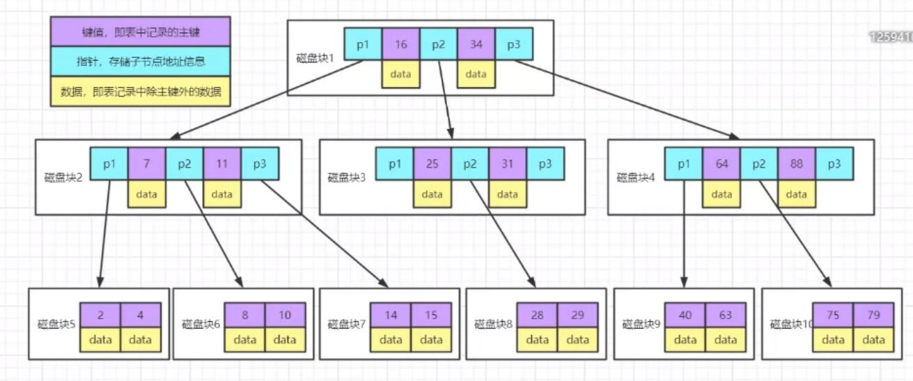
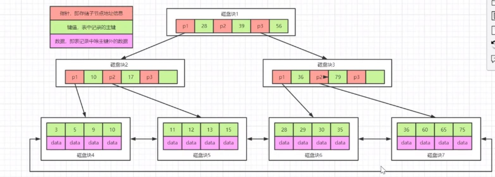
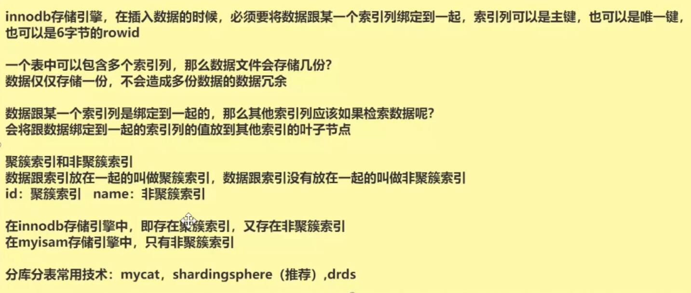
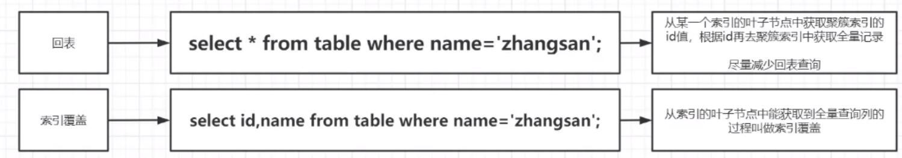
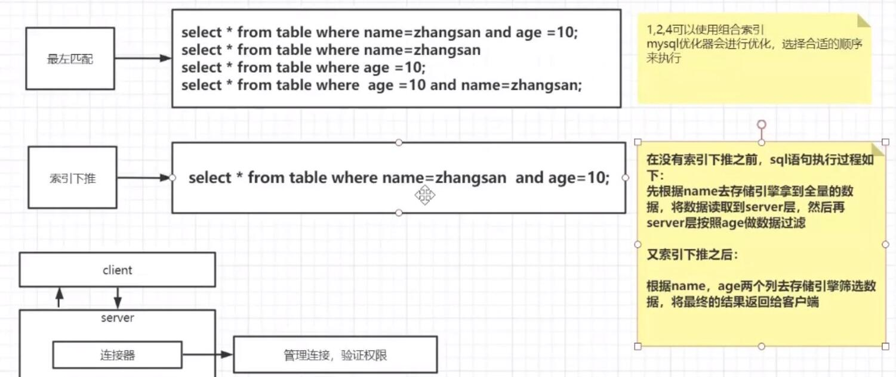
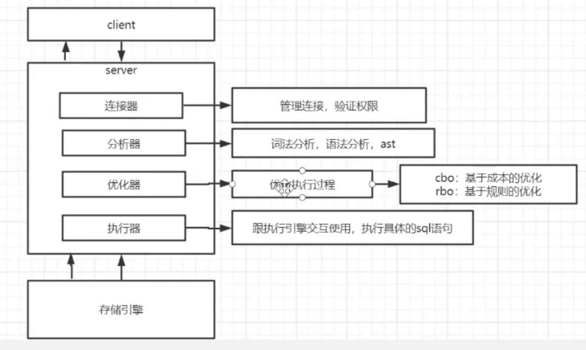

# 索引及MySQL优化

> 视频来源B站分享的公开课: [点我跳转](https://www.bilibili.com/video/BV1ui4y1F7rZ?p=1)

## 阐述的问题


- 尝试性解答: 

```
1. 索引的原理, 为什么使用索引, 更快的查找数据. 索引就是排好序的数据, 所谓索引就是: 排序查询, 
如何才能查找更快呢, 这个就可以引出MySQL底层的数据结构, 然后MySQL的数据结构就是和存储引擎相关的,
就5.7版本, 默认使用的存储引擎是 Innodb, 当然还有比Innodb早一点的, MyiSAM, 这里又可以引出, 两种存储引擎的异同. 
所以与其说原理, 其实就是问得底层的数据结构. 执行引擎负责, 把对应的数据存储到磁盘上, 存储引擎就是接口, Innodb和MyiSAM
就是两个具体的实现. 底层原理 B+ 树, 优化的历史: 
Hash (范围查找时间复杂度增加)
二叉树(数据增加深度增加)
B树(二三树, 存储的数据量有限, 因为pagesize 存放 data 太浪费了)
B+树

2. 区别就是B+树把data都放到叶子节点上了.

3. 数据和索引的绑定, 比如主键索引就是聚簇索引, 其他字段建立的索引, 没有和整行数据进行绑定, 
每次查询的, 如何使用非聚簇索引, 会有两个步骤: 
第一, 通过索引B+树获取的, K值
第二, 利用K 去获取全量数据, 这个就是数据回表. 
避免回表, 采用覆盖索引

4. 左前缀法则

5. Innodb(两种类型): 表结构结构, rdb数据文件(索引和数据一起的); MYiSAM(三种类型): 表结构文件, 索引, 数据

6. 组合, 就是多个字段作为索引, 为索引覆盖做准备. 

7. 索引
```

## B树结构



## B+树结构



## 认知


## 回表


## 名词


## MYSQL 底层结构



