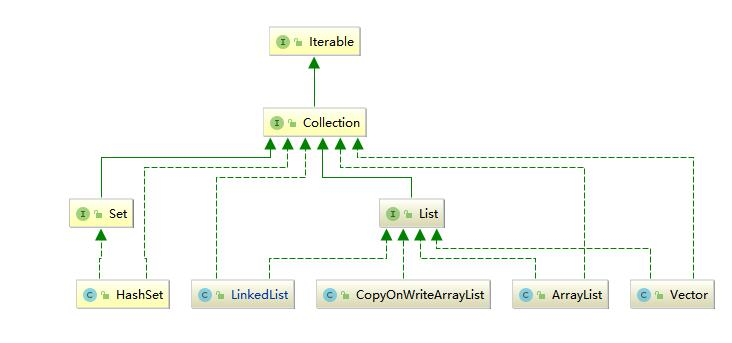
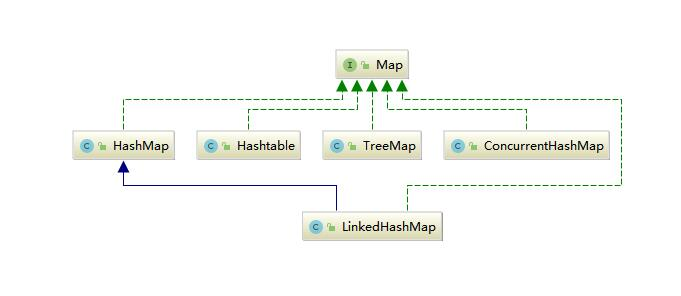

1. 简单做一个自我介绍?

```
(各位面试官, 上午好!), 
我叫郑毕忠, 2017年毕业于武昌理工学院电子信息工程专业, 
毕业后就职于深圳市优博讯科技股份有限公司.  
公司的主要业务是生产制造移动智能终端、POS机、工业手机、扫码枪等设备。
任职期间从事JAVA开发的工作， 主要从事公司主营产品后台开发工作。
工作期间主要接触的项目包括：产品生命周期管理项目、商户运营平台、客户终端管理平台、设备API服务等项目。本次希望找一份JAVA开发或JAVA项目运维的工作。
自己平时也会逛一下开源中国, GitBub, 学习一些流行的项目框架
期望薪资10K。以上就是本人简单的自我介绍。
```
2. 说一下最近做的一个项目?

```
工作中, 最近做的一个项目就是 "产品生命周期管理" 系统, 这个系统的引入, 是为了
控制和管理, 产品的迭代周期, 尽量能高质量和高效率做产品的数据, 就是一种管理手段. 
项目的引入: 前员工的引入. 
PDM项目组. 
产品的实现, 美国PTC公司 Windchill平台. 
德国, 西门子 Enovia
国产, Arics

最早期的一个产品, Windchill, 做二次开发.
后端: java, 1.4
前端: Extjs, 1.4

Rose
公司有自己的框架

```

3. List, Map, Set的理解?





4. 线程池

```
Executor

ThreadPoolExecutor
1. core
2. max
3. blocking
4. hander
5. Unit
6. 时间
7. 线程工程

分类讨论:
1. 按照core
Excuetors.new....

RejectHandler...

```
5. 线程池的种类

6. B+树的结构

7. 分布式锁

9. AQS
java.util.concurrent.lock.AQS

认知: 我仅仅是想活着....

# 分布式Session

```
1. 分布式系统必须使用 分布式Session
2. 不使用分布式Session 会存在用户session 丢失的现象
2.1 服务端, Session 同步
2.2 Ngnix IPHash
2.3 Redis, 保存Session 信息
```

# 23种常见设计模式

```
1. 工厂模式, 抽象工厂, 工厂方法
2. 单例
3. 原型
4. 代理
5. 模板方法
6. 适配器
7. 装饰器
```

# 设计原则

```
1. 开闭原则
2. 

```

